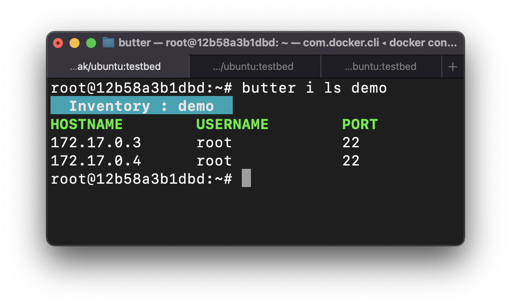
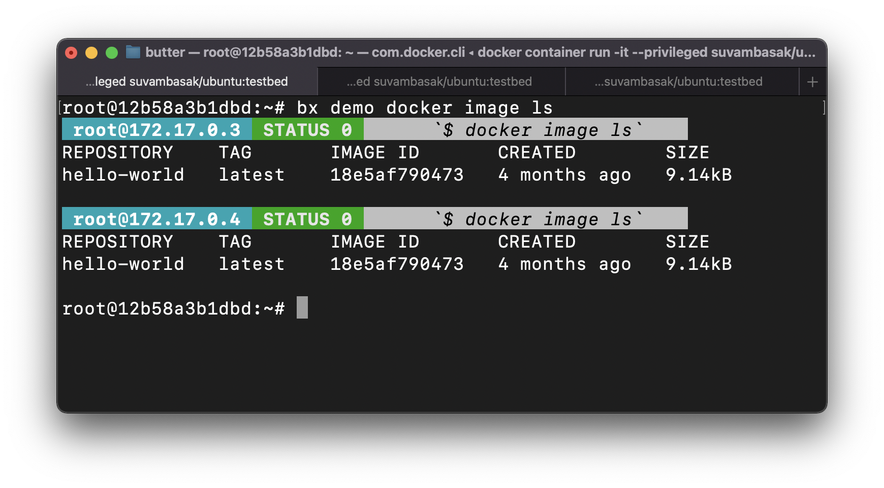

# Butter 🧈 - SSH Client
Lightweight SSH-Client. Build to manage IoT devices (like Raspberry Pis) VMs, Systems. It is agentless and relies on SSH Infrastructure. Fully capable of remotely executing commands on inventories and fetching you the consolidated outputs.

## Table of Contents
- [Requirments](#requirments)
- [Secure Shell Setup](#secure-shell-setup)
- [Installation](#installation)
- [Walk Through](#walk-through)
- [License](#license)

## Requirments
- Works with Unix-based systems (Linux, macOS)
- Python 3.7 or higher
- SSH passwordless login

## Secure Shell Setup
### Generate SSH Key Pair
The system running `Butter` should be able to login into each device through SSH without a password. So, generate SSH key pair and copy the public key to all other devices.
```bash
ssh-keygen
```
### Copy the Public Key
```bash
ssh-copy-id pi@192.168.0.XXX
```

## Installation
1. Clone the `butter` repository
```bash
git clone https://github.com/cloud-and-smart-labs/butter.git
```

2. Install the package
```bash
pip install butter
```

### Enabling Command Auto-completion
- Linux Systems (Bash Shell)
```bash
_BUTTER_COMPLETE=bash_source butter > ~/.butter-complete.bash && echo '. ~/.butter-complete.bash' >> ~/.bashrc && source ~/.bashrc
```
- MacOS (zsh Shell) <br>
The completion system needs to be activated. Add the following to your `~/.zshrc` or `~/.zprofile`
```bash
autoload -Uz compinit
compinit
```
Then enabling Auto-completion
```bash
echo 'eval "$(_BUTTER_COMPLETE=zsh_source butter)"' >> ~/.zprofile && source ~/.zprofile &&  echo 'eval "$(_BUTTER_COMPLETE=zsh_source butter)"' >> ~/.zprofile && source ~/.zprofile
```

## Walk Through
Butter has two types of commands:
1. `inventory:` Creates inventory that contains the SSH details of hosts
2. `Exe`cute: Executes the commands on inventories

```bash
butter --help
```

### Inventory
1. Create inventory `demo`
```bash
butter inventory create demo
```
```bash
butter inventory create demo_1 demo_2 demo_3
```
2. Add hosts into the inventory `demo`
```bash
butter inventory add demo root@172.17.0.3 root@172.17.0.4
```
3. Get list of inventories
```bash
butter inventory ls
```
```bash
butter inventory ls -a
```
4. Get list of Hosts inside inventory
```bash
butter inventory ls demo
```

<p align="center">
    
</p>

```bash
butter inventory ls demo_1 demo_2 
```

5. Remove host from inventory
```bash
butter inventory rm demo 172.17.0.3 172.17.0.4
```
OR
```bash
butter inventory rm demo root@172.17.0.3 root@172.17.0.4
```
6. Remove inventory `demo`
```bash
butter inventory clear demo 
```
Clear all
```bash
butter inventory clear -a
```

### Execute
Execute commands
```bash
butter exe sh demo 'docker image ls'
```
`-s`: Serially Stream
```bash
butter exe sh demo 'docker image ls' -s
```
OR use shorter one <br>
`bx` : `b`utter e`x`ecute
```bash
bx demo 'docker image ls'
```
```bash
bx demo 'docker image ls' -s
```
<p align="center">
    
</p>


## License
This tool is licensed under the [Apache License 2.0](https://www.apache.org/licenses/LICENSE-2.0).